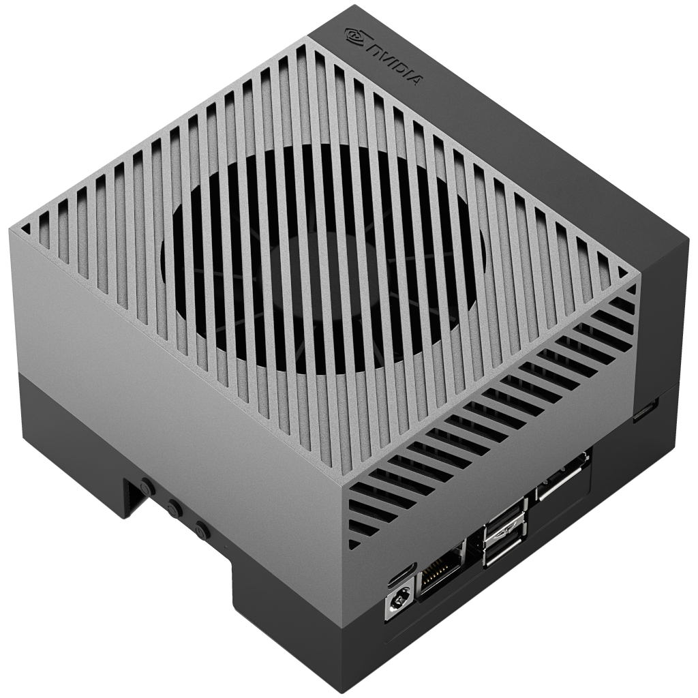
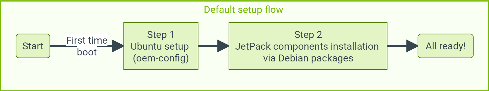
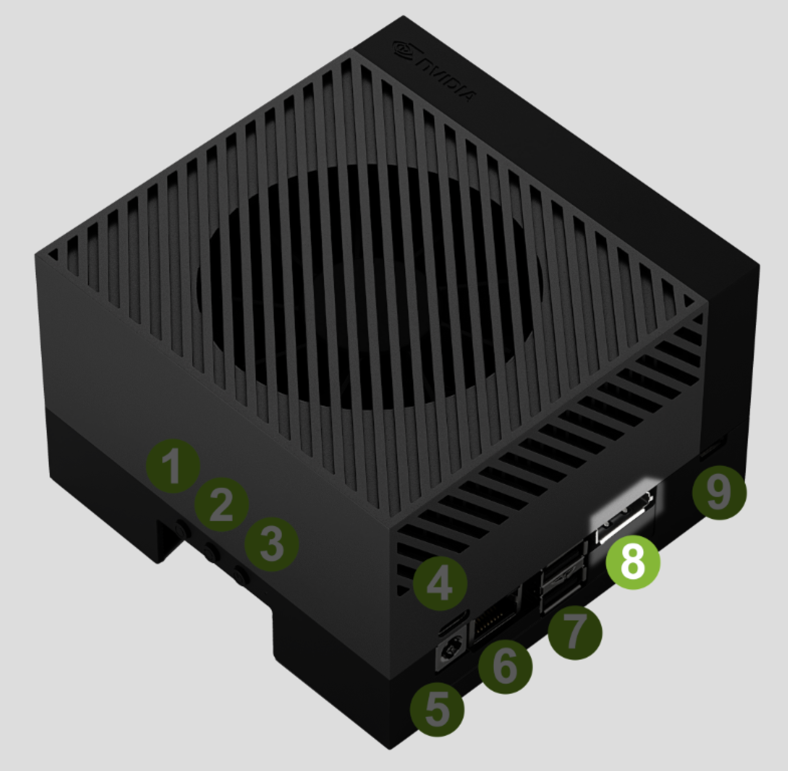
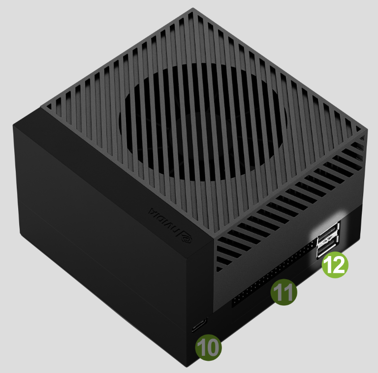
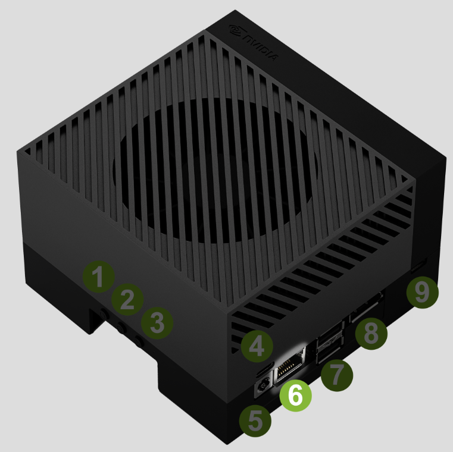
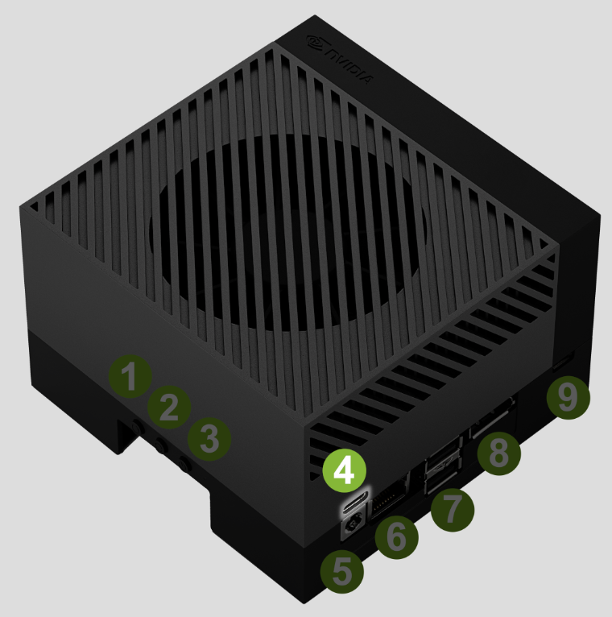
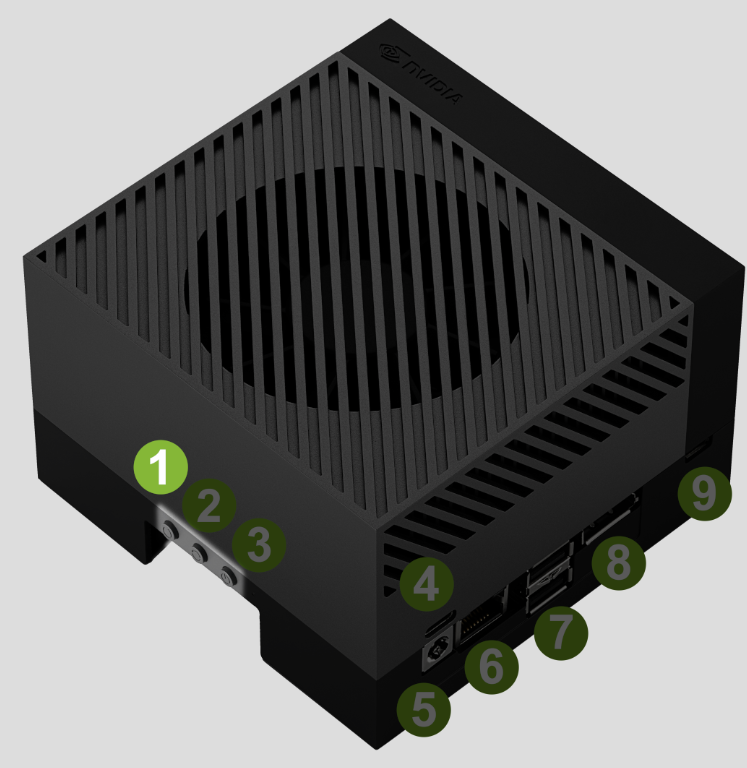

# NVIDIA® Jetson AGX Orin™ Developer Kit Setup Guide

NVIDIA® Jetson AGX Orin™ Developer Kit enables development of full-featured AI applications for products based on Jetson Orin modules. It includes a high-performance, power-efficient Jetson AGX Orin module, and can emulate the other Jetson Orin modules.

</img>

This guide explains how to quickly set up your NVIDIA® Jetson AGX Orin™ Developer Kit for your development needs.

</img>

### Included in the Box
Your Jetson AGX Orin Developer Kit includes:
- NVIDIA Jetson AGX module with heat sink and reference carrier board
- 802.11ac/abgn wireless Network Interface Controller
- USB Type-C power supply
- USB Type-C to USB Type-A cable
- Quick Start and Support Guide

### What You'll Need
- Internet connection
- And you need either of the following set (for headless, see below):

| Setup Option | Initial setup with display attached | Initial setup in a headless configuration |
|--------------|-------------------------------------|-------------------------------------------|
| PC monitor with DisplayPort cable | Required | Not required |
| USB keyboard and mouse | Required | Not required |
| Extra computer (Windows, Mac, Linux) | Not required | Required |

## Instructions

### Step 1 - Run through Ubuntu Setup (oem-config)
There are two ways to interact with the developer kit: with a display, keyboard, and mouse attached ("display attached" or "headed" configuration); or in a “headless" configuration through a connection from another (host) computer.

You can conduct the initial setup either way.

| Setup Option | Initial setup with display attached | Initial setup in a headless configuration |
|--------------|-------------------------------------|-------------------------------------------|
| Monitor, keyboard and mouse | ❗ Required | Not required |
| Extra computer (Windows, Mac, Linux) | Not required | ❗ Required |

#### Initial setup with display attached
First, connect the following to the developer kit:
- DisplayPort cable attached to a computer monitor

  - For a monitor with HDMI input, use an active DisplayPort to HDMI adapter/cable.
    
    <div align=left></img></div>

- USB keyboard and mouse
  <div align=left></img></div>

- Ethernet cable (optional if you plan to connect to the Internet via WLAN)
  <div align=left></img></div>

- Then connect the included power supply into the USB Type-C™ port above the DC jack.
  <div align=left></img></div>

- Your developer kit should automatically power on, and the white LED near the power button will light.
  <div align=left></img></div>

- If not, press the Power button.
  <div align=left></img></div>

Wait up to 1 minute to have the Ubuntu screen on the computer monitor.

When you boot for the first time, the developer kit will take you through some initial setup, including:
- Review and accept NVIDIA Jetson software EULA
- Select system language, keyboard layout, and time zone
- Create username, password, and computer name
- Configure wireless networking

Upon completing the oem-config, the developer kit reboots, and you should see the Ubuntu desktop.

Move onto the next step.

### Step 2 - Install JetPack Components
Once the initial setup is complete, you can install the latest JetPack components that correspond to your L4T version from the Internet.

Open a terminal window if you are on Ubuntu desktop (`Ctrl+Alt+T`).

> **Attention**
>
> Check your L4T version first to see if you have a unit flashed with an older version of the BSP.
> 
> ```bash
> cat /etc/nv_tegra_release
> ```
> 
> You may get something like this:
> ```
> # R34 (release), REVISION: 1.0, GCID: 30102743, BOARD: t186ref, EABI: aarch64, DATE: Wed Apr 6 19:11:41 UTC 2022
> ```
> This shows that you have L4T for JetPack 5.0 Developer Preview.
>
> If you have an earlier version of L4T, issue the following command to manually put the apt repository entries using commands below.
> ```bash
> sudo bash -c 'echo "deb https://repo.download.nvidia.com/jetson/common r34.1 main" >> /etc/apt/sources.list.d/nvidia-l4t-apt-source.list'
> sudo bash -c 'echo "deb https://repo.download.nvidia.com/jetson/t234 r34.1 main" >> /etc/apt/sources.list.d/nvidia-l4t-apt-source.list'
> ```
> 
> If you see `R34 (release), REVISION: 1.0` or newer, then your apt sources lists are already up to date and you can proceed.

Issue the following commands to install JetPack components.
```bash
sudo apt update
sudo apt dist-upgrade
sudo reboot
sudo apt install nvidia-jetpack
```
It can take about an hour to complete the installation (depending on the speed of your Internet connection).

> **Note**
> 
> For more detail, see the "Package Management Tool" section of "JetPack documentation".

## Install jtop command 

```bash
sudo -H pip3 install -U jetson-stats
```
> `sudo` is a command in Unix-based operating systems used to run a command with elevated privileges, often requiring the user to enter a password.
> 
> `-H` is an option used with `sudo` to set the HOME environment variable to the target user's home directory.
> 
> `pip3` is a package installer for Python 3.
> 
> `install` is a subcommand used with `pip3` to install packages.
> 
> `-U` is an option for `pip3 install` used to upgrade existing packages to the latest version.
> 
> `jetson-stats` is the name of the package being installed or upgraded by `pip3`.
> 
> Putting them together, the command `sudo -H pip3 install -U jetson-stats` is used to install or upgrade the Python 3 `jetson-stats` package with elevated privileges. It sets the HOME environment variable to the root user's home directory and upgrades any existing version of the package to the latest available version. This command is typically used on NVIDIA Jetson devices to monitor and manage system resources.


# Jetson Devices and JetPack Versions for Various Models

| Model                                     | Category                  | Jetson Devices                                    | JetPack Versions                         |
|-------------------------------------------|---------------------------|---------------------------------------------------|------------------------------------------|
| text-generation-webui                     | `Text (LLM)`              | `AGX Orin (64GB)`, `AGX Orin (32GB)`, `Orin NX (16GB)`, `Orin Nano (8GB)` | `JetPack 5 (L4T r35.x)`, `JetPack 6 (L4T r36.x)` |
| Ollama                                    | `Text (LLM)`              | `AGX Orin (64GB)`, `AGX Orin (32GB)`, `Orin NX (16GB)`, `Orin Nano (8GB)` | `JetPack 5 (L4T r35.x)`, `JetPack 6 (L4T r36.x)` |
| llamaspeak                                | `Text (LLM)`              | `AGX Orin (64GB)`, `AGX Orin (32GB)`, `Orin NX (16GB)`  | `JetPack 6 (L4T r36)`                      |
| Small Language Models (SLM)               | `Text (LLM)`              | `AGX Orin (64GB)`, `AGX Orin (32GB)`, `Orin NX (16GB)`, `Orin Nano (8GB)` | `JetPack 6 (L4T r36.x)`                    |
| Text+Vision(VLM) MiniGPT-4                | `Text+Vision (VLM)`       | `AGX Orin (64GB)`, `AGX Orin (32GB)`, `Orin NX (16GB)`  | `JetPack 5 (L4T r35.x)`, `JetPack 6 (L4T r36.x)` |
| Text+Vision(VLM) LLaVA                    | `Text+Vision (VLM)`       | `AGX Orin (64GB)`, `AGX Orin (32GB)`, `Orin NX (16GB)`  | `JetPack 5 (L4T r35.x)`, `JetPack 6 (L4T r36.x)` |
| Text+Vision(VLM) Live LLaVA               | `Text+Vision (VLM)`       | `AGX Orin (64GB)`, `AGX Orin (32GB)`, `Orin NX (16GB)`, `Orin Nano (8GB)` | `JetPack 6 (L4T r36.x)`                    |
| NanoVLM - Efficient Multimodal Pipeline   | `Text+Vision (VLM)`       | `AGX Orin (64GB)`, `AGX Orin (32GB)`, `Orin NX (16GB)`, `Orin Nano (8GB)` | `JetPack 6 (L4T r36)`                      |
| Image Generation Stable Diffusion         | `Image Generation`        | `AGX Orin (64GB)`, `AGX Orin (32GB)`, `Orin NX (16GB)`, `Orin Nano (8GB)` | `JetPack 5 (L4T r35.x)`, `JetPack 6 (L4T r36.x)` |
| Image Generation Stable Diffusion XL      | `Image Generation`        | `AGX Orin (64GB)`, `AGX Orin (32GB)`                  | `JetPack 5 (L4T r35.x)`, `JetPack 6 (L4T r36.x)` |
| Vision Transformers(VIT) EfficientViT     | `Vision Transformers (ViT)` | `AGX Orin (64GB)`, `AGX Orin (32GB)`, `Orin NX (16GB)`, `Orin Nano (8GB)` | `JetPack 5 (L4T r35.x)`, `JetPack 6 (L4T r36.x)` |
| NanoOWL                                   | `Vision Transformers (ViT)` | `AGX Orin (64GB)`, `AGX Orin (32GB)`, `Orin NX (16GB)`, `Orin Nano (8GB)` | `JetPack 5 (L4T r35.x)`, `JetPack 6 (L4T r36.x)` |
| NanoSAM                                   | `Vision Transformers (ViT)` | `AGX Orin (64GB)`, `AGX Orin (32GB)`, `Orin NX (16GB)`, `Orin Nano (8GB)` | `JetPack 5 (L4T r35.x)`, `JetPack 6 (L4T r36.x)` |
| SAM (Segment Anything)                    | `Vision Transformers (ViT)` | `AGX Orin (64GB)`, `AGX Orin (32GB)`, `Orin NX (16GB)`, `Orin Nano (8GB)` | `JetPack 5 (L4T r35.x)`, `JetPack 6 (L4T r36.x)` |
| SAM (Segment Anything)                    | `Vision Transformers (ViT)` | `AGX Orin (64GB)`, `AGX Orin (32GB)`                  | `JetPack 5 (L4T r35.x)`                    |
| Vector Database NanoDB                    | `Vector Database`         | `AGX Orin (64GB)`, `AGX Orin (32GB)`, `Orin NX (16GB)`, `Orin Nano (8GB)` | `JetPack 5 (L4T r35.x)`, `JetPack 6 (L4T r36.x)` |
| Audio Whisper                             | `Audio`                   | `AGX Orin (64GB)`, `AGX Orin (32GB)`, `Orin NX (16GB)`, `Orin Nano (8GB)` | `JetPack 5 (L4T r35.x)`, `JetPack 6 (L4T r36.x)` |
| AudioCraft                                | `Audio`                   | `AGX Orin (64GB)`, `AGX Orin (32GB)`, `Orin Nano (8GB)` | `JetPack 5 (L4T r35.x)`                    |
| VoiceCraft                                | `Audio`                   | `AGX Orin (64GB)`, `AGX Orin (32GB)`                  | `JetPack 6 (L4T r36.x)`                    |
